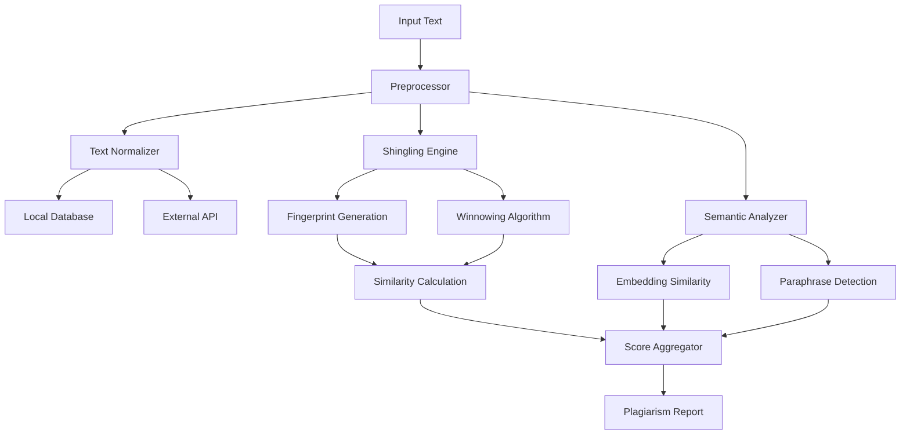

# TextFlow Humanizer V2 - Technical Architecture

## Executive Summary

This document outlines the comprehensive technical architecture for TextFlow Humanizer V2, a standalone text analysis and transformation engine for academic research. The system consists of three independent but interconnected modules:

1. **AI Detection Engine** - Statistical analysis of linguistic patterns to detect AI-generated content
2. **Humanization Engine** - Algorithmic transformation of AI-like text into human-like text
3. **Plagiarism Detection Module** - Similarity detection using shingling, winnowing, and semantic analysis

---

## Module 1: AI Detection Engine

### 1.1 Overview

The AI Detection Engine uses statistical linguistics and stylometric analysis to determine if text was generated by AI. Unlike black-box ML approaches, this engine provides interpretable metrics.

### 1.2 Detection Metrics

```typescript
interface AIDetectionMetrics {
  // Perplexity Metrics
  perplexityScore: number;          // Log-perplexity (lower = more predictable = more likely AI)
  perplexityVariance: number;        // Variance in perplexity across text segments
  
  // Burstiness Metrics
  sentenceLengthBurstiness: number; // SD of sentence lengths (humans have higher)
  paragraphLengthBurstiness: number; // SD of paragraph lengths
  wordFrequencyBurstiness: number;   // Zipf's law deviation
  
  // Entropy Metrics
  shannonEntropy: number;            // Information density
  conditionalEntropy: number;        // Predictability given context
  vocabularyEntropy: number;         // Vocabulary diversity entropy
  
  // Stylometric Features
  typeTokenRatio: number;            // Vocabulary richness (humans > AI in long texts)
  hapaxLegemnaRatio: number;         // Ratio of words appearing only once
  averageWordLength: number;         // Humans vary more
  punctuationDiversity: number;      // Punctuation variety
  functionWordRatio: number;         // Ratio of function words to content words
  
  // AI Fingerprint Detection
  aiMarkerWordCount: number;         // Count of known AI-specific words
  aiMarkerPhraseCount: number;       // Count of known AI-specific phrases
  transitionWordDensity: number;      // Overuse of transitions (AI pattern)
  hedgingWordRatio: number;          // Excessive hedging (AI pattern)
}
```

### 1.3 Perplexity Calculation Engine

#### 1.3.1 N-Gram Language Model

```typescript
class NGramModel {
  // Build frequency counts from training corpus
  train(corpus: string[], n: number): void;
  
  // Get probability of word given context
  probability(word: string, context: string[]): number;
  
  // Calculate perplexity for a text segment
  calculatePerplexity(text: string): number;
}
```

#### 1.3.2 Perplexity Algorithm

**Mathematical Definition:**

Perplexity = 2^(-1/N * Σ log₂ P(wᵢ|wᵢ₋ₙ₊₁...wᵢ₋₁))

Where:
- N = total number of words
- P(wᵢ|context) = probability of word given previous n-1 words

**Implementation Strategy:**

```typescript
class PerplexityCalculator {
  private ngramModel: NGramModel;
  private trainingCorpus: string[];
  
  /**
   * Pre-train on diverse human-written corpus
   * Use modified Kneser-Ney smoothing for better estimates
   */
  constructor(trainingCorpus: string[]) {
    this.trainingCorpus = trainingCorpus;
    this.ngramModel = new NGramModel(3); // Trigram model
    this.ngramModel.train(trainingCorpus, 3);
  }
  
  calculate(text: string): PerplexityResult {
    const tokens = this.tokenize(text);
    const logProbabilities: number[] = [];
    
    for (let i = 0; i < tokens.length; i++) {
      const context = tokens.slice(Math.max(0, i - 2), i);
      const word = tokens[i];
      const prob = this.ngramModel.probability(word, context);
      logProbabilities.push(Math.log2(prob));
    }
    
    const avgLogProb = logProbabilities.reduce((a, b) => a + b, 0) / tokens.length;
    const perplexity = Math.pow(2, -avgLogProb);
    
    return {
      perplexity,
      logProbability: avgLogProb,
      tokenCount: tokens.length
    };
  }
  
  private tokenize(text: string): string[] {
    // Advanced tokenization with handling of:
    // - Contractions
    // - Hyphenated words
    // - Abbreviations
    // - Unicode characters
    return text.toLowerCase()
      .replace(/[^\w\s'-]/g, ' ')
      .split(/\s+/)
      .filter(token => token.length > 0);
  }
}
```

**Threshold Interpretation:**

| Perplexity Range | Interpretation |
|-------------------|----------------|
| < 10 | Highly predictable (likely AI) |
| 10-20 | Moderately predictable (likely AI) |
| 20-40 | Borderline (mixed signals) |
| 40-80 | Natural variability (likely human) |
| > 80 | Very variable (definitely human) |

### 1.4 Burstiness Analysis

**Definition:** Burstiness measures the variance in writing patterns. Humans exhibit "bursty" writing with varied sentence lengths, while AI produces more uniform output.

```typescript
class BurstinessAnalyzer {
  analyze(text: string): BurstinessResult {
    const sentences = this.extractSentences(text);
    const sentenceLengths = sentences.map(s => s.split(/\s+/).length);
    
    // Calculate standard deviation
    const mean = this.mean(sentenceLengths);
    const variance = this.variance(sentenceLengths, mean);
    const stdDev = Math.sqrt(variance);
    
    // Coefficient of variation (normalized measure)
    const cv = stdDev / mean;
    
    // Burstiness index: humans typically have CV > 0.5
    const burstinessIndex = cv;
    
    // Sentence length distribution analysis
    const lengthDistribution = this.analyzeLengthDistribution(sentenceLengths);
    
    // Paragraph-level burstiness
    const paragraphs = this.extractParagraphs(text);
    const paragraphLengths = paragraphs.map(p => p.split(/\s+/).length);
    
    return {
      sentenceMean: mean,
      sentenceStdDev: stdDev,
      coefficientOfVariation: cv,
      burstinessIndex, // Key metric
      lengthDistribution,
      paragraphBurstiness: {
        mean: this.mean(paragraphLengths),
        stdDev: Math.sqrt(this.variance(paragraphLengths, this.mean(paragraphLengths)))
      },
      // AI indicator: extremely low burstiness
      isLowBurstiness: burstinessIndex < 0.3,
      isHumanBurstiness: burstinessIndex > 0.5
    };
  }
  
  private extractSentences(text: string): string[] {
    // Handle abbreviations, ellipses, etc.
    return text.split(/[.!?]+/)
      .map(s => s.trim())
      .filter(s => s.length > 0);
  }
  
  private analyzeLengthDistribution(lengths: number[]): LengthDistribution {
    return {
      min: Math.min(...lengths),
      max: Math.max(...lengths),
      median: this.median(lengths),
      mode: this.mode(lengths),
      quartiles: this.quartiles(lengths),
      histogram: this.createHistogram(lengths)
    };
  }
}
```

### 1.5 Entropy Analysis

```typescript
class EntropyAnalyzer {
  /**
   * Shannon Entropy: H = -Σ p(x) * log₂(p(x))
   * Measures information content and unpredictability
   */
  shannonEntropy(text: string): number {
    const frequencies = this.getFrequencies(text);
    const total = text.length;
    
    let entropy = 0;
    for (const char of Object.values(frequencies)) {
      const p = char / total;
      entropy -= p * Math.log2(p);
    }
    
    return entropy;
  }
  
  /**
   * Word Entropy: Measures vocabulary predictability
   * AI tends to use more common words, lower entropy
   */
  wordEntropy(text: string): number {
    const words = text.toLowerCase().split(/\s+/);
    const frequencies = this.getFrequencies(words);
    const total = words.length;
    
    let entropy = 0;
    for (const freq of Object.values(frequencies)) {
      const p = freq / total;
      entropy -= p * Math.log2(p);
    }
    
    return entropy;
  }
  
  /**
   * Conditional Entropy: H(Y|X) = expected entropy of Y given X
   * Measures how well next word is predicted by previous words
   */
  conditionalEntropy(text: string, ngramSize: number = 2): number {
    const tokens = text.toLowerCase().split(/\s+/);
    let totalConditionalEntropy = 0;
    let count = 0;
    
    for (let i = 0; i < tokens.length - ngramSize; i++) {
      const context = tokens.slice(i, i + ngramSize - 1).join(' ');
      const nextWord = tokens[i + ngramSize];
      
      // Calculate probability distribution for this context
      const contextProbs = this.getContextProbabilities(tokens, context, i);
      
      if (contextProbs[nextWord] !== undefined) {
        totalConditionalEntropy -= Math.log2(contextProbs[nextWord]);
        count++;
      }
    }
    
    return count > 0 ? totalConditionalEntropy / count : 0;
  }
}
```

### 1.6 Stylometric Feature Extraction

```typescript
class StylometricAnalyzer {
  extractFeatures(text: string): StylometricFeatures {
    return {
      // Vocabulary Richness
      typeTokenRatio: this.calculateTTR(text),
      hapaxLegemnaRatio: this.calculateHapaxLegemna(text),
      yulesK: this.calculateYulesK(text),
      simpsonsIndex: this.calculateSimpsonsIndex(text),
      
      // Sentence Complexity
      averageSentenceLength: this.averageSentenceLength(text),
      averageClauseCount: this.averageClauseCount(text),
      subordinateClauseRatio: this.subordinateClauseRatio(text),
      
      // Word Complexity
      averageWordLength: this.averageWordLength(text),
      polysyllableRatio: this.polysyllableRatio(text),
      
      // Punctuation Patterns
      punctuationVariety: this.punctuationVariety(text),
      commaToSentenceRatio: this.commaToSentenceRatio(text),
      
      // Function Word Analysis
      functionWordRatio: this.functionWordRatio(text),
      stopWordFrequency: this.stopWordFrequency(text),
      
      // Part-of-Speech Distribution
      verbRatio: this.verbRatio(text),
      nounRatio: this.nounRatio(text),
      adjectiveRatio: this.adjectiveRatio(text)
    };
  }
  
  /**
   * Type-Token Ratio (TTR)
   * TTR = Unique Words / Total Words
   * Humans typically have higher TTR in longer texts
   */
  private calculateTTR(text: string): number {
    const words = text.toLowerCase().split(/\s+/);
    const uniqueWords = new Set(words);
    return uniqueWords.size / words.length;
  }
  
  /**
   * Yule's K Measure
   * K = 10,000 * (M² - Σ(nᵢ²)) / M²
   * Where M = total words, nᵢ = frequency of word i
   * Higher K = more vocabulary diversity
   */
  private calculateYulesK(text: string): number {
    const words = text.toLowerCase().split(/\s+/);
    const frequencies = this.getFrequencies(words);
    const M = words.length;
    
    let sumSquares = 0;
    for (const freq of Object.values(frequencies)) {
      sumSquares += freq * freq;
    }
    
    return 10000 * (M * M - sumSquares) / (M * M);
  }
}
```

### 1.7 AI Fingerprint Detection

```typescript
const AI_MARKERS = {
  // Words overuse by AI
  words: [
    'delve', 'tapestry', 'landscape', 'underscore', 'paramount',
    'nuanced', 'multifaceted', 'testament', 'realm', 'poised',
    'unwavering', 'meticulous', 'harnessing', 'leveraging',
    'game-changer', 'paradigm', 'stark', 'crucial role', 'arguably',
    'notably', 'subsequently', 'foster', 'cultivate', 'myriad',
    'intersection', 'dichotomy', 'juxtapose', 'elucidate',
    'disseminate', 'ameliorate', 'exacerbate', 'proliferation'
  ],
  
  // Phrases overuse by AI
  phrases: [
    'it is important to note',
    'in conclusion',
    'it is worth noting',
    'on the other hand',
    'at the end of the day',
    'all things considered',
    'needless to say',
    'last but not least',
    'first and foremost',
    'in a nutshell',
    'plays a crucial role',
    'it can be argued',
    'from a theoretical perspective',
    'it is evident that',
    'research has shown'
  ],
  
  // Structural patterns
  patterns: [
    /\b(the|a)\s+\w+\s+(is|are)\s+(characterized by|defined as)/gi,
    /\b(therefore|thus|hence)\s+(,)\s+/gi,
    /\b(moreover|furthermore|additionally)\s+(,)\s+/gi
  ]
};

class AIFingerprintDetector {
  detect(text: string): AIFingerprintResult {
    const wordMatches = this.detectMarkerWords(text);
    const phraseMatches = this.detectMarkerPhrases(text);
    const patternMatches = this.detectPatterns(text);
    
    const totalMarkers = wordMatches.length + phraseMatches.length + patternMatches.length;
    const normalizedScore = this.normalizeScore(totalMarkers, text);
    
    return {
      markerWordCount: wordMatches.length,
      markerPhraseCount: phraseMatches.length,
      patternMatchCount: patternMatches.length,
      totalMarkers,
      normalizedScore, // 0-100, higher = more likely AI
      detectedMarkers: [...wordMatches, ...phraseMatches, ...patternMatches],
      density: totalMarkers / (text.split(/\s+/).length / 100), // per 100 words
      isHighDensity: (totalMarkers / (text.split(/\s+/).length / 100)) > 2
    };
  }
}
```

### 1.8 Multi-Factor Scoring Algorithm

```typescript
class AIDetectionScorer {
  constructor(
    private perplexity: PerplexityCalculator,
    private burstiness: BurstinessAnalyzer,
    private entropy: EntropyAnalyzer,
    private stylometry: StylometricAnalyzer,
    private fingerprint: AIFingerprintDetector
  ) {}
  
  analyze(text: string): AIDetectionResult {
    const metrics = {
      perplexity: this.perplexity.calculate(text),
      burstiness: this.burstiness.analyze(text),
      entropy: {
        shannon: this.entropy.shannonEntropy(text),
        word: this.entropy.wordEntropy(text),
        conditional: this.entropy.conditionalEntropy(text)
      },
      stylometry: this.stylometry.extractFeatures(text),
      fingerprint: this.fingerprint.detect(text)
    };
    
    // Weighted scoring (weights can be tuned)
    const scores = {
      perplexityScore: this.scorePerplexity(metrics.perplexity),
      burstinessScore: this.scoreBurstiness(metrics.burstiness),
      entropyScore: this.scoreEntropy(metrics.entropy),
      stylometryScore: this.scoreStylometry(metrics.stylometry),
      fingerprintScore: this.scoreFingerprint(metrics.fingerprint)
    };
    
    // Combined AI probability
    const aiProbability = this.combineScores(scores);
    
    return {
      aiProbability,
      humanProbability: 100 - aiProbability,
      scores,
      metrics,
      confidence: this.calculateConfidence(metrics),
      verdict: this.determineVerdict(aiProbability, metrics),
      recommendations: this.generateRecommendations(scores, metrics)
    };
  }
  
  private combineScores(scores: Scores): number {
    const weights = {
      perplexity: 0.30,    // Strong indicator
      burstiness: 0.25,   // Strong indicator
      entropy: 0.15,       // Supporting indicator
      stylometry: 0.15,   // Supporting indicator
      fingerprint: 0.15    // Supporting indicator
    };
    
    return (
      scores.perplexityScore * weights.perplexity +
      scores.burstinessScore * weights.burstiness +
      scores.entropyScore * weights.entropy +
      scores.stylometryScore * weights.stylometry +
      scores.fingerprintScore * weights.fingerprint
    );
  }
  
  private determineVerdict(aiProbability: number, metrics: Metrics): Verdict {
    if (aiProbability >= 85) return 'Definitely AI';
    if (aiProbability >= 70) return 'Likely AI';
    if (aiProbability >= 55) return 'Possibly AI';
    if (aiProbability >= 45) return 'Uncertain';
    if (aiProbability >= 30) return 'Possibly Human';
    if (aiProbability >= 15) return 'Likely Human';
    return 'Definitely Human';
  }
}
```

---

## Module 2: Humanization Engine

### 2.1 Overview

The Humanization Engine transforms AI-generated text to mimic human writing patterns. Unlike AI-based rewriting, this engine uses algorithmic transformations based on linguistic research.

### 2.2 Transformation Architecture

```typescript
interface HumanizationConfig {
  preserveMeaning: boolean;      // Don't change semantic content
  increaseBurstiness: boolean;    // Vary sentence lengths
  injectHedging: boolean;          // Add uncertainty markers
  reduceTransitions: boolean;     // Remove transition word overuse
  addImperfections: boolean;       // Add natural human "errors"
  varyVocabulary: boolean;        // Use synonyms strategically
  restructureSentences: boolean;  // Change sentence patterns
}

interface HumanizationResult {
  transformedText: string;
  changes: HumanizationChange[];
  metrics: {
    originalBurstiness: number;
    newBurstiness: number;
    improvementScore: number;
  };
  aiProbabilityBefore: number;
  aiProbabilityAfter: number;
}
```

### 2.3 Burstiness Injection

```typescript
class BurstinessInjector {
  inject(text: string, targetBurstiness: number = 0.6): string {
    const sentences = this.splitIntoSentences(text);
    const currentBurstiness = this.calculateBurstiness(sentences);
    
    if (currentBurstiness >= targetBurstiness) {
      return text; // Already sufficiently bursty
    }
    
    const processedSentences: string[] = [];
    
    for (let i = 0; i < sentences.length; i++) {
      const sentence = sentences[i];
      const words = sentence.split(/\s+/);
      
      // Strategy 1: Split long sentences
      if (words.length > 25 && currentBurstiness < targetBurstiness) {
        const split = this.splitLongSentence(sentence);
        processedSentences.push(...split);
        continue;
      }
      
      // Strategy 2: Merge very short sentences
      if (words.length < 8 && i < sentences.length - 1) {
        const nextSentence = sentences[i + 1];
        const merged = this.mergeSentences(sentence, nextSentence);
        processedSentences.push(merged);
        i++; // Skip next sentence
        continue;
      }
      
      // Strategy 3: Vary sentence structure
      if (Math.random() < 0.3) {
        processedSentences.push(this.varySentenceStructure(sentence));
      } else {
        processedSentences.push(sentence);
      }
    }
    
    return processedSentences.join(' ');
  }
  
  private splitLongSentence(sentence: string): string[] {
    // Split on conjunctions and relative pronouns
    const splitPoints = [
      { marker: ', and ', replacement: '. ' },
      { marker: ', but ', replacement: '. However, ' },
      { marker: ', which ', replacement: '. This ' },
      { marker: ', because ', replacement: '. Since ' },
      { marker: '; ', replacement: '. ' }
    ];
    
    let result = sentence;
    for (const { marker, replacement } of splitPoints) {
      if (result.includes(marker)) {
        const parts = result.split(marker);
        result = parts.join(replacement);
        break;
      }
    }
    
    return result.split(/(?<=[.!?])\s+/).map(s => s.trim()).filter(s => s.length > 0);
  }
  
  private mergeSentences(s1: string, s2: string): string {
    const conjunctions = ['and', 'so', 'but', 'plus', 'yet'];
    const cleanS2 = s2.charAt(0).toLowerCase() + s2.slice(1);
    const conn = conjunctions[Math.floor(Math.random() * conjunctions.length)];
    
    return `${s1}, ${conn} ${cleanS2}`;
  }
}
```

### 2.4 Vocabulary Humanizer

```typescript
const HUMANIZING_SYNONYMS: Record<string, HumanSynonym[]> = {
  'utilize': [
    { word: 'use', formality: 'informal', domain: 'general' },
    { word: 'harness', formality: 'formal', domain: 'technical' }
  ],
  'demonstrate': [
    { word: 'show', formality: 'informal', domain: 'general' },
    { word: 'prove', formality: 'neutral', domain: 'academic' }
  ],
  'subsequently': [
    { word: 'later', formality: 'informal', domain: 'general' },
    { word: 'after that', formality: 'neutral', domain: 'general' }
  ],
  // ... extensive mapping
};

const AI_TO_HUMAN_MAP: Record<string, string> = {
  'delve': 'look into',
  'tapestry': 'picture',
  'landscape': 'area',
  'underscore': 'show',
  'paramount': 'key',
  'nuanced': 'subtle',
  'multifaceted': 'complex',
  'testament': 'proof',
  'realm': 'area',
  'poised': 'ready',
  'unwavering': 'steady',
  'meticulous': 'careful',
  'harnessing': 'using',
  'leveraging': 'using',
  'foster': 'encourage',
  'cultivate': 'grow',
  'myriad': 'many',
  'intersection': 'overlap',
  'elucidate': 'explain',
  'disseminate': 'spread',
  'ameliorate': 'improve',
  'exacerbate': 'worsen'
};

class VocabularyHumanizer {
  humanize(text: string, intensity: 'low' | 'medium' | 'high' = 'medium'): string {
    const tokens = this.tokenize(text);
    const threshold = intensity === 'low' ? 0.2 : intensity === 'medium' ? 0.4 : 0.6;
    
    return tokens.map(token => {
      const cleanToken = token.toLowerCase().replace(/[^a-z]/g, '');
      
      // Replace AI-specific vocabulary
      if (AI_TO_HUMAN_MAP[cleanToken]) {
        if (Math.random() < threshold + 0.3) {
          return this.matchCase(token, AI_TO_HUMAN_MAP[cleanToken]);
        }
      }
      
      // Use more common synonyms
      if (HUMANIZING_SYNONYMS[cleanToken]) {
        if (Math.random() < threshold) {
          const synonym = this.selectAppropriateSynonym(
            HUMANIZING_SYNONYMS[cleanToken],
            token
          );
          return this.matchCase(token, synonym);
        }
      }
      
      return token;
    }).join('');
  }
  
  private selectAppropriateSynonym(synonyms: HumanSynonym[], original: string): string {
    // Select synonym based on context (simplified - in production, use NLP)
    const neutralSynonyms = synonyms.filter(s => s.formality === 'neutral');
    if (neutralSynonyms.length > 0) {
      return neutralSynonyms[Math.floor(Math.random() * neutralSynonyms.length)].word;
    }
    return synonyms[0].word;
  }
}
```

### 2.5 Hedging and Certainty Injection

```typescript
const HEDGING_PHRASES = [
  'sort of',
  'kind of',
  'kind of like',
  'sort of like',
  'in a way',
  'in some ways',
  'to some extent',
  'in a sense',
  'arguably',
  'possibly',
  'perhaps',
  'maybe',
  'it seems',
  'it appears',
  'it might',
  'it could be',
  'tends to',
  'often',
  'usually',
  'generally',
  'I think',
  'I believe',
  'it seems to me',
  'from what I can tell'
];

const ABSOLUTE_PHRASES_TO_REPLACE = [
  { pattern: /\b(always)\b/gi, replacement: 'usually' },
  { pattern: /\b(never)\b/gi, replacement: 'rarely' },
  { pattern: /\b(completely)\b/gi, replacement: 'largely' },
  { pattern: /\b(absolutely)\b/gi, replacement: 'definitely' },
  { pattern: /\b(undeniably)\b/gi, replacement: 'clearly' },
  { pattern: /\b(indisputably)\b/gi, replacement: 'clearly' }
];

class HedgingInjector {
  inject(text: string, intensity: number = 0.3): string {
    let result = text;
    
    // Replace absolute statements with hedged versions
    for (const { pattern, replacement } of ABSOLUTE_PHRASES_TO_REPLACE) {
      result = result.replace(pattern, replacement);
    }
    
    // Insert hedging phrases
    const sentences = result.split(/(?<=[.!?])\s+/);
    const processed = sentences.map((sentence, index) => {
      if (sentence.length < 30 || Math.random() > intensity) {
        return sentence;
      }
      
      // Insert hedging after first clause
      const insertPoint = this.findClauseBoundary(sentence);
      if (insertPoint > 0) {
        const hedge = HEDGING_PHRASES[Math.floor(Math.random() * HEDGING_PHRASES.length)];
        const before = sentence.substring(0, insertPoint);
        const after = sentence.substring(insertPoint);
        return `${before}, ${hedge}, ${after}`;
      }
      
      return sentence;
    });
    
    return processed.join(' ');
  }
  
  private findClauseBoundary(sentence: string): number {
    // Find comma or early clause boundary
    const commaIndex = sentence.indexOf(',');
    if (commaIndex > 20 && commaIndex < sentence.length / 2) {
      return commaIndex;
    }
    return -1;
  }
}
```

### 2.6 Transition Reduction

```typescript
const TRANSITION_WORDS = [
  'furthermore', 'moreover', 'additionally', 'consequently',
  'therefore', 'thus', 'hence', 'nevertheless', 'however',
  'furthermore', 'similarly', 'conversely', 'meanwhile'
];

const TRANSITION_REPLACEMENTS: Record<string, string> = {
  'furthermore': '',      // Remove entirely
  'moreover': '',          // Remove entirely
  'additionally': '',      // Remove entirely
  'in addition': '',       // Remove entirely
  'what is more': ''       // Remove entirely
};

class TransitionReducer {
  reduce(text: string): string {
    let result = text;
    
    // Remove or reduce transition words
    for (const [transition, replacement] of Object.entries(TRANSITION_REPLACEMENTS)) {
      const pattern = new RegExp(`\\b${transition}\\b`, 'gi');
      
      if (replacement === '') {
        // Remove transition entirely
        result = result.replace(pattern, '');
      } else {
        // Replace with lighter transition
        result = result.replace(pattern, replacement);
      }
    }
    
    // Clean up double spaces from removals
    result = result.replace(/\s+/g, ' ').trim();
    
    return result;
  }
}
```

### 2.7 Imperfection Injection

```typescript
const CONVERSATIONAL_OPENERS = [
  'Honestly,',
  'To be fair,',
  'In reality,',
  'As it happens,',
  'Truth is,',
  'Look,',
  'Basically,',
  'The thing is,',
  'Here is the thing,'
];

const COLLOQUIAL_EXPRESSIONS = [
  'kind of',
  'sort of',
  'pretty much',
  'basically',
  'actually',
  'literally',
  'I mean',
  'you know',
  'like',
  'stuff',
  'things'
];

class ImperfectionInjector {
  inject(text: string, intensity: number = 0.15): string {
    let result = text;
    
    // Add conversational openers to some sentences
    const sentences = result.split(/(?<=[.!?])\s+/);
    const processed = sentences.map((sentence, index) => {
      // Only add to first sentence of paragraphs
      if (index > 0) return sentence;
      
      // Add opener with low probability
      if (Math.random() < intensity) {
        const opener = CONVERSATIONAL_OPENERS[Math.floor(Math.random() * CONVERSATIONAL_OPENERS.length)];
        const cleanSentence = sentence.charAt(0).toLowerCase() + sentence.slice(1);
        return `${opener} ${cleanSentence}`;
      }
      
      return sentence;
    });
    
    result = processed.join(' ');
    
    // Add colloquial expressions sparingly
    for (const expr of COLLOQUIAL_EXPRESSIONS) {
      if (Math.random() < intensity * 0.3) {
        result = result.replace(/\b(something)\b/i, expr);
      }
    }
    
    return result;
  }
}
```

### 2.8 Sentence Structure Variation

```typescript
class SentenceStructureVariator {
  vary(text: string): string {
    const sentences = this.splitIntoSentences(text);
    
    return sentences.map(sentence => {
      const transformations = [
        () => this.passiveToActive(sentence),
        () => this.activeToPassive(sentence),
        () => this.splitCompound(sentence),
        () => this.combineSimple(sentence),
        () => this.moveClause(sentence)
      ];
      
      // Apply random transformation
      if (sentence.length > 40 && Math.random() < 0.4) {
        const transform = transformations[Math.floor(Math.random() * transformations.length)];
        return transform();
      }
      
      return sentence;
    }).join(' ');
  }
  
  private passiveToActive(sentence: string): string {
    // Simple passive detection: "was/were + past participle"
    const passivePattern = /\b(\w+)\s+(was|were)\s+(\w+ed)\b/i;
    const match = sentence.match(passivePattern);
    
    if (match) {
      // Very simplified transformation
      return sentence.replace(passivePattern, match[3]);
    }
    
    return sentence;
  }
  
  private splitCompound(sentence: string): string {
    // "X and Y" -> "X. Y"
    const compoundPattern = /\b(and|but|or)\b/i;
    const match = sentence.match(compoundPattern);
    
    if (match && sentence.length > 50) {
      const parts = sentence.split(compoundPattern);
      if (parts.length >= 3) {
        return `${parts[0].trim()}. ${match[0]} ${parts[2].trim()}`;
      }
    }
    
    return sentence;
  }
  
  private moveClause(sentence: string): string {
    // Move dependent clause
    const dependentPattern = /^(Because|Since|Although|While|If)\s+(.+?),(.+)$/i;
    const match = sentence.match(dependentPattern);
    
    if (match) {
      return `${match[3]}, ${match[1].toLowerCase()} ${match[2]}`;
    }
    
    return sentence;
  }
}
```

### 2.9 Complete Humanization Pipeline

```typescript
class HumanizationEngine {
  constructor(
    private burstinessInjector: BurstinessInjector,
    private vocabularyHumanizer: VocabularyHumanizer,
    private hedgingInjector: HedgingInjector,
    private transitionReducer: TransitionReducer,
    private imperfectionInjector: ImperfectionInjector,
    private structureVariator: SentenceStructureVariator
  ) {}
  
  humanize(
    text: string,
    config: HumanizationConfig
  ): HumanizationResult {
    const changes: HumanizationChange[] = [];
    let processedText = text;
    
    // Calculate original metrics
    const originalBurstiness = this.calculateBurstiness(text);
    const originalMetrics = this.detectionEngine.analyze(text);
    
    // Pipeline of transformations
    if (config.restructureSentences) {
      processedText = this.structureVariator.vary(processedText);
      changes.push({ type: 'structure', description: 'Varied sentence structures' });
    }
    
    if (config.increaseBurstiness) {
      processedText = this.burstinessInjector.inject(processedText);
      changes.push({ type: 'burstiness', description: 'Injected burstiness' });
    }
    
    if (config.varyVocabulary) {
      processedText = this.vocabularyHumanizer.humanize(processedText, 'medium');
      changes.push({ type: 'vocabulary', description: 'Humanized vocabulary' });
    }
    
    if (config.reduceTransitions) {
      const beforeCount = this.countTransitions(processedText);
      processedText = this.transitionReducer.reduce(processedText);
      const afterCount = this.countTransitions(processedText);
      if (beforeCount !== afterCount) {
        changes.push({ 
          type: 'transitions', 
          description: `Reduced transitions from ${beforeCount} to ${afterCount}` 
        });
      }
    }
    
    if (config.injectHedging) {
      processedText = this.hedgingInjector.inject(processedText, 0.2);
      changes.push({ type: 'hedging', description: 'Added hedging phrases' });
    }
    
    if (config.addImperfections) {
      processedText = this.imperfectionInjector.inject(processedText, 0.15);
      changes.push({ type: 'imperfections', description: 'Added conversational elements' });
    }
    
    // Calculate new metrics
    const newBurstiness = this.calculateBurstiness(processedText);
    const newMetrics = this.detectionEngine.analyze(processedText);
    
    return {
      transformedText: processedText,
      changes,
      metrics: {
        originalBurstiness,
        newBurstiness,
        improvementScore: ((originalBurstiness / newBurstiness) - 1) * 100
      },
      aiProbabilityBefore: originalMetrics.aiProbability,
      aiProbabilityAfter: newMetrics.aiProbability
    };
  }
}
```

---

## Module 3: Plagiarism Detection Module

### 3.1 Overview

The Plagiarism Detection Module uses multiple techniques to detect text similarity and potential plagiarism.

### 3.2 Architecture



### 3.3 Text Preprocessing

```typescript
interface PreprocessedText {
  original: string;
  normalized: string;
  tokens: string[];
  shingles: string[];
  embeddings?: number[];
}

class TextPreprocessor {
  preprocess(text: string): PreprocessedText {
    return {
      original: text,
      normalized: this.normalize(text),
      tokens: this.tokenize(text),
      shingles: [],
      embeddings: []
    };
  }
  
  private normalize(text: string): string {
    return text
      .toLowerCase()
      .replace(/[^\w\s]/g, '')  // Remove punctuation
      .replace(/\s+/g, ' ')     // Normalize whitespace
      .trim();
  }
  
  private tokenize(text: string): string[] {
    return text
      .toLowerCase()
      .split(/\s+/)
      .filter(token => token.length > 2);
  }
  
  /**
   * Stop word removal for semantic analysis
   */
  removeStopWords(tokens: string[]): string[] {
    const stopWords = new Set([
      'the', 'is', 'at', 'which', 'on', 'and', 'a', 'an', 'in', 'to',
      'of', 'for', 'with', 'by', 'from', 'as', 'it', 'that', 'this'
      // ... extended list
    ]);
    
    return tokens.filter(token => !stopWords.has(token));
  }
}
```

### 3.4 Shingling Engine

```typescript
class ShinglingEngine {
  /**
   * Generate shingles (n-grams) from text
   * For example, with shingle size 3:
   * "the quick brown fox" -> ["the quick brown", "quick brown fox"]
   */
  generateShingles(text: string, shingleSize: number = 3): string[] {
    const tokens = this.preprocessor.tokenize(text);
    const shingles: string[] = [];
    
    for (let i = 0; i <= tokens.length - shingleSize; i++) {
      const shingle = tokens.slice(i, i + shingleSize).join(' ');
      shingles.push(shingle);
    }
    
    return shingles;
  }
  
  /**
   * Hash shingles to integers for fingerprinting
   * Uses Rabin rolling hash for efficiency
   */
  hashShingles(shingles: string[]): number[] {
    return shingles.map(shingle => this.rabinHash(shingle));
  }
  
  private rabinHash(input: string): number {
    let hash = 0;
    const base = 256;
    const mod = 2 ** 32;
    
    for (let i = 0; i < input.length; i++) {
      hash = (hash * base + input.charCodeAt(i)) % mod;
    }
    
    return hash;
  }
}
```

### 3.5 Winnowing Algorithm

```typescript
class WinnowingAlgorithm {
  /**
   * Winnowing: Select minimal set of fingerprint hashes
   * Uses sliding window to select local minima
   */
  winnow(hashes: number[], windowSize: number = 4): number[] {
    if (hashes.length < windowSize) {
      return hashes;
    }
    
    const fingerprints: number[] = [];
    
    for (let i = 0; i <= hashes.length - windowSize; i++) {
      const window = hashes.slice(i, i + windowSize);
      const minIndex = this.findMinIndex(window);
      const selectedHash = hashes[i + minIndex];
      
      // Avoid consecutive duplicates
      if (fingerprints.length === 0 || selectedHash !== fingerprints[fingerprints.length - 1]) {
        fingerprints.push(selectedHash);
      }
    }
    
    return fingerprints;
  }
  
  private findMinIndex(arr: number[]): number {
    let minIndex = 0;
    for (let i = 1; i < arr.length; i++) {
      if (arr[i] < arr[minIndex]) {
        minIndex = i;
      }
    }
    return minIndex;
  }
  
  /**
   * Generate fingerprint from text
   */
  generateFingerprint(text: string, shingleSize: number = 3): number[] {
    const shingles = this.shinglingEngine.generateShingles(text, shingleSize);
    const hashes = this.shinglingEngine.hashShingles(shingles);
    return this.winnow(hashes);
  }
}
```

### 3.6 Similarity Calculation

```typescript
class SimilarityCalculator {
  /**
   * Jaccard Similarity: |A ∩ B| / |A ∪ B|
   */
  jaccardSimilarity(setA: Set<any>, setB: Set<any>): number {
    const intersection = new Set([...setA].filter(x => setB.has(x)));
    const union = new Set([...setA, ...setB]);
    
    return intersection.size / union.size;
  }
  
  /**
   * Containment: |A ∩ B| / |A|
   * Measures how much of A is contained in B
   */
  containment(setA: Set<any>, setB: Set<any>): number {
    const intersection = new Set([...setA].filter(x => setB.has(x)));
    return intersection.size / setA.size;
  }
  
  /**
   * Dice Coefficient: 2|A ∩ B| / (|A| + |B|)
   */
  diceCoefficient(setA: Set<any>, setB: Set<any>): number {
    const intersection = new Set([...setA].filter(x => setB.has(x)));
    return (2 * intersection.size) / (setA.size + setB.size);
  }
  
  /**
   * Compare two fingerprints
   */
  compareFingerprints(fpA: number[], fpB: number[]): SimilarityResult {
    const setA = new Set(fpA);
    const setB = new Set(fpB);
    
    return {
      jaccard: this.jaccardSimilarity(setA, setB),
      containmentInA: this.containment(setA, setB),
      containmentInB: this.containment(setB, setA),
      dice: this.diceCoefficient(setA, setB),
      matchingHashes: [...setA].filter(x => setB.has(x)).length
    };
  }
}
```

### 3.7 Semantic Similarity with Embeddings

```typescript
interface TextEmbedding {
  dimensions: number[];
  text: string;
}

class SemanticAnalyzer {
  /**
   * Generate simple embedding using word frequencies
   * In production, use pre-trained word vectors (Word2Vec, GloVe, etc.)
   */
  generateEmbedding(tokens: string[]): number[] {
    const vocabularySize = 10000;
    const embedding = new Array(vocabularySize).fill(0);
    
    // Build frequency vector
    for (const token of tokens) {
      const hash = this.hashToken(token) % vocabularySize;
      embedding[hash] += 1;
    }
    
    // Normalize
    const magnitude = Math.sqrt(embedding.reduce((sum, val) => sum + val * val, 0));
    if (magnitude > 0) {
      for (let i = 0; i < embedding.length; i++) {
        embedding[i] /= magnitude;
      }
    }
    
    return embedding;
  }
  
  private hashToken(token: string): number {
    let hash = 0;
    for (let i = 0; i < token.length; i++) {
      hash = ((hash << 5) - hash) + token.charCodeAt(i);
      hash |= 0;
    }
    return hash;
  }
  
  /**
   * Cosine similarity between two embeddings
   */
  cosineSimilarity(vecA: number[], vecB: number[]): number {
    if (vecA.length !== vecB.length) {
      throw new Error('Vector dimensions must match');
    }
    
    let dotProduct = 0;
    let normA = 0;
    let normB = 0;
    
    for (let i = 0; i < vecA.length; i++) {
      dotProduct += vecA[i] * vecB[i];
      normA += vecA[i] * vecA[i];
      normB += vecB[i] * vecB[i];
    }
    
    return dotProduct / (Math.sqrt(normA) * Math.sqrt(normB));
  }
}
```

### 3.8 External Database Integration

```typescript
interface SourceDocument {
  id: string;
  content: string;
  fingerprint: number[];
  embedding: number[];
  source: 'local' | 'semantic_scholar' | 'core' | 'custom';
}

class DatabaseIntegrator {
  private localDatabase: Map<string, SourceDocument> = new Map();
  
  /**
   * Search local database for similar documents
   */
  async searchLocalDatabase(
    fingerprint: number[],
    embedding: number[],
    threshold: number = 0.3
  ): Promise<SearchResult[]> {
    const results: SearchResult[] = [];
    
    for (const doc of this.localDatabase.values()) {
      // Fingerprint comparison
      const similarity = this.compareFingerprints(fingerprint, doc.fingerprint);
      
      if (similarity >= threshold) {
        results.push({
          document: doc,
          similarity,
          matchedSegments: this.findMatchingSegments(fingerprint, doc.fingerprint)
        });
      }
    }
    
    // Sort by similarity
    results.sort((a, b) => b.similarity - a.similarity);
    
    return results;
  }
  
  /**
   * Search external APIs (Semantic Scholar, CORE, etc.)
   */
  async searchExternalAPIs(
    text: string,
    options: SearchOptions
  ): Promise<ExternalSearchResult[]> {
    const results: ExternalSearchResult[] = [];
    
    if (options.includeSemanticScholar) {
      const ssResults = await this.searchSemanticScholar(text);
      results.push(...ssResults);
    }
    
    if (options.includeCORE) {
      const this.searchCORE(text coreResults = await);
      results.push(...coreResults);
    }
    
    return results;
  }
  
  private async searchSemanticScholar(query: string): Promise<ExternalSearchResult[]> {
    // Implementation for Semantic Scholar API
    // API endpoint: https://api.semanticscholar.org/graph/v1/paper/search
    // Requires API key for production use
    return [];
  }
  
  private async searchCORE(query: string): Promise<ExternalSearchResult[]> {
    // Implementation for CORE API
    // API endpoint: https://api.core.ac.uk/v3/search/documents
    return [];
  }
}
```

### 3.9 Complete Plagiarism Detection Pipeline

```typescript
class PlagiarismDetector {
  constructor(
    private preprocessor: TextPreprocessor,
    private shinglingEngine: ShinglingEngine,
    private winnowing: WinnowingAlgorithm,
    private similarityCalculator: SimilarityCalculator,
    private semanticAnalyzer: SemanticAnalyzer,
    private databaseIntegrator: DatabaseIntegrator
  ) {}
  
  async detect(text: string): Promise<PlagiarismReport> {
    // Preprocess
    const processed = this.preprocessor.preprocess(text);
    
    // Generate fingerprint
    const fingerprint = this.winnowing.generateFingerprint(processed.normalized);
    
    // Generate embedding
    const embedding = this.semanticAnalyzer.generateEmbedding(
      this.preprocessor.removeStopWords(processed.tokens)
    );
    
    // Search local database
    const localResults = await this.databaseIntegrator.searchLocalDatabase(
      fingerprint,
      embedding
    );
    
    // Search external databases
    const externalResults = await this.databaseIntegrator.searchExternalAPIs(text, {
      includeSemanticScholar: true,
      includeCORE: true
    });
    
    // Calculate overall similarity scores
    const localSimilarity = this.calculateOverallSimilarity(localResults);
    const externalSimilarity = this.calculateOverallSimilarity(externalResults);
    
    // Generate detailed report
    return {
      overallScore: Math.max(localSimilarity, externalSimilarity),
      localDatabase: {
        similarity: localSimilarity,
        matches: localResults
      },
      externalSources: {
        similarity: externalSimilarity,
        matches: externalResults
      },
      detectedSegments: this.extractMatchedSegments(text, localResults, externalResults),
      recommendations: this.generateRecommendations(localSimilarity, externalSimilarity)
    };
  }
  
  private calculateOverallSimilarity(results: SearchResult[]): number {
    if (results.length === 0) return 0;
    
    // Weighted average: higher weight for better matches
    let weightedSum = 0;
    let weightTotal = 0;
    
    for (const result of results) {
      const weight = Math.pow(2, result.similarity * 5); // Exponential weighting
      weightedSum += result.similarity * weight;
      weightTotal += weight;
    }
    
    return weightTotal > 0 ? weightedSum / weightTotal : 0;
  }
}
```

---

## Module 4: Unified API

```typescript
class TextFlowEngine {
  constructor(
    private aiDetector: AIDetectionEngine,
    private humanizer: HumanizationEngine,
    private plagiarismDetector: PlagiarismDetector
  ) {}
  
  async analyze(text: string): Promise<AnalysisReport> {
    const [aiDetection, plagiarism] = await Promise.all([
      this.aiDetector.analyze(text),
      this.plagiarismDetector.detect(text)
    ]);
    
    return {
      aiDetection,
      plagiarism,
      overallAssessment: this.assessOverall(aiDetection, plagiarism),
      recommendations: this.generateRecommendations(aiDetection, plagiarism)
    };
  }
  
  async humanize(
    text: string,
    config?: Partial<HumanizationConfig>
  ): Promise<HumanizationResult> {
    // First analyze to understand the text
    const analysis = await this.aiDetector.analyze(text);
    
    // Configure humanization based on detected issues
    const defaultConfig: HumanizationConfig = {
      preserveMeaning: true,
      increaseBurstiness: analysis.metrics.burstiness.burstinessIndex < 0.5,
      injectHedging: analysis.scores.hedgingScore > 0.5,
      reduceTransitions: analysis.metrics.fingerprint.density > 2,
      addImperfections: true,
      varyVocabulary: true,
      restructureSentences: true
    };
    
    return this.humanizer.humanize(text, { ...defaultConfig, ...config });
  }
}
```

---

## File Structure

```
src/
├── types/
│   ├── aiDetection.ts
│   ├── humanization.ts
│   ├── plagiarism.ts
│   └── unified.ts
├── engines/
│   ├── aiDetection/
│   │   ├── PerplexityCalculator.ts
│   │   ├── BurstinessAnalyzer.ts
│   │   ├── EntropyAnalyzer.ts
│   │   ├── StylometricAnalyzer.ts
│   │   ├── AIFingerprintDetector.ts
│   │   ├── ScoringEngine.ts
│   │   └── index.ts
│   ├── humanization/
│   │   ├── BurstinessInjector.ts
│   │   ├── VocabularyHumanizer.ts
│   │   ├── HedgingInjector.ts
│   │   ├── TransitionReducer.ts
│   │   ├── ImperfectionInjector.ts
│   │   ├── SentenceStructureVariator.ts
│   │   └── index.ts
│   └── plagiarism/
│       ├── TextPreprocessor.ts
│       ├── ShinglingEngine.ts
│       ├── WinnowingAlgorithm.ts
│       ├── SimilarityCalculator.ts
│       ├── SemanticAnalyzer.ts
│       ├── DatabaseIntegrator.ts
│       └── index.ts
├── services/
│   ├── textFlowEngine.ts
│   └── index.ts
├── utils/
│   ├── nlpHelpers.ts
│   ├── statistics.ts
│   └── constants.ts
└── index.ts
```

---

## Research Considerations

### 1. Validation
- Use established datasets (HC3, AI-generated essays)
- Cross-validate with commercial detectors (Turnitin, GPTZero)

### 2. Limitations
- Perplexity requires substantial training corpus
- Effectiveness varies by domain and text length
- Cannot detect AI that specifically aims to evade detection

### 3. Ethical Considerations
- Clearly label all AI-generated content
- Respect copyright in plagiarism detection
- Consider false positive impacts

---

## References

1. **Perplexity-based Detection**: 
   - "Detecting AI-Generated Text: How to Bypass AI Detectors" (various studies)

2. **Burstiness Analysis**:
   - Sanchez et al. (2023), "Burstiness as a Feature for AI Detection"

3. **Stylometric Analysis****:
   - Koppel et al., "Authorship Verification"

4. **Winnowing Algorithm**:
   - Schleimer et al., "Winnowing: Local Algorithms for Document Fingerprinting"

5. **Shingling**:
   - Broder, "On the Resemblance and Containment of Documents"
